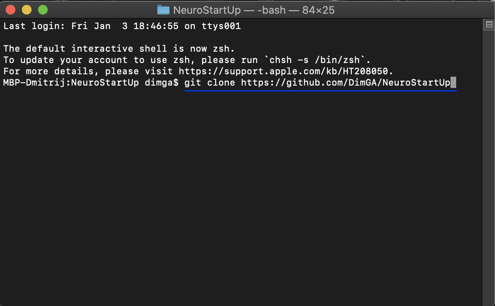
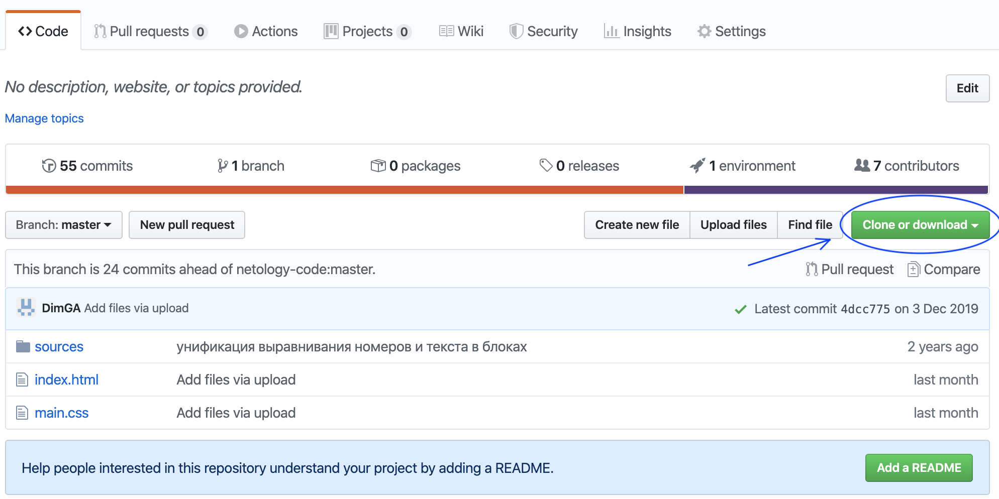

# Git.README.md

# NeuroStartUp

NeuroStartUp - динамически развивающийся стартап, специализирующийся на поиске с использованием новейших технологий искусственного интеллекта.

## Начало работы

---

Для того, чтобы получить копию данного проекта, вам необходимо сделать следующее:

### Prerequisites

1. **Установить Git на вашу локальную машину (персональный компьютер/ноутбук):**

- [Git для Windows](https://git-scm.com/download/win)
- [Git для Mac OS](https://git-scm.com/download/mac)
- [Git для Linux](https://git-scm.com/download/linux)

2.  **Установить браузер:**

        ВНИМАНИЕ: Если у вас уже есть браузер, то данный пункт можно пропустить. Если нет, то рекомендуем вам скачать, а затем установить любой бразуер из представленных на ваш выбор:

- [Google Chrome](https://www.google.ru/intl/ru/chrome/?brand=CHBD&gclsrc=aw.ds&&gclid=CjwKCAiA6bvwBRBbEiwAUER6JXBaVY5TV-bL0yqtRdQTovnX6zhYcu-67H80gFvPtVWIn-L0PfkVkxoCtkUQAvD_BwE&gclid=CjwKCAiA6bvwBRBbEiwAUER6JXBaVY5TV-bL0yqtRdQTovnX6zhYcu-67H80gFvPtVWIn-L0PfkVkxoCtkUQAvD_BwE)
- [Mozila Firefox](https://www.mozilla.org/ru/firefox/new/)
- [Opera](https://www.opera.com/ru)

### Установка и запуск

**Пошаговый процесс установки и запуска:**

После того, как вы успешно установили Git, а также удостоверились в наличии браузера на вашем ПК, то следующим шагом переходим к непосредственной загрузке копии данного проекта на ваш локальный компьютер. Перед этим рекомендуем вам создать отдельную папку для данного проекта. Переходим к загрузке копии. Сделать это можно двумя способами:

1. **Вариант №1 (через терминал)**

   Через терминал, с использованием специальной команды "git clone https://github.com/DimGA/NeuroStartUp":

   

   ВНИМАНИЕ: Если у вас возникли трудности при работе с терминалом, то рекомендем вам ознакомиться с данным [мануалом](https://github.com/netology-code/guides/blob/master/git-terminal/git-terminal.md)

2) **Вариант №2 (через сайт)**

   Напрямую скачать данный проект с удаленного репозитория по данному адресу [(ссылка на проект)](https://github.com/DimGA/NeuroStartUp.git):
   

**Запуск**

Непосредственный запуск любого интересующего файла проекта теперь можно осуществить из локальной папки на вашем компьюторе, которую вы заведомо создали перед загрузкой проекта.

## Лицензия

---

Copyright (c) <2019> < NeuroStartUp >

Данная лицензия разрешает лицам, получившим копию данного программного обеспечения и сопутствующей документации (в дальнейшем именуемыми «Программное обеспечение»), безвозмездно использовать Программное обеспечение без ограничений, включая неограниченное право на использование, копирование, изменение, слияние, публикацию, распространение, сублицензирование и/или продажу копий Программного обеспечения, а также лицам, которым предоставляется данное Программное обеспечение, при соблюдении следующих условий:

Указанное выше уведомление об авторском праве и данные условия должны быть включены во все копии или значимые части данного Программного обеспечения.

ДАННОЕ ПРОГРАММНОЕ ОБЕСПЕЧЕНИЕ ПРЕДОСТАВЛЯЕТСЯ «КАК ЕСТЬ», БЕЗ КАКИХ-ЛИБО ГАРАНТИЙ, ЯВНО ВЫРАЖЕННЫХ ИЛИ ПОДРАЗУМЕВАЕМЫХ, ВКЛЮЧАЯ ГАРАНТИИ ТОВАРНОЙ ПРИГОДНОСТИ, СООТВЕТСТВИЯ ПО ЕГО КОНКРЕТНОМУ НАЗНАЧЕНИЮ И ОТСУТСТВИЯ НАРУШЕНИЙ, НО НЕ ОГРАНИЧИВАЯСЬ ИМИ. НИ В КАКОМ СЛУЧАЕ АВТОРЫ ИЛИ ПРАВООБЛАДАТЕЛИ НЕ НЕСУТ ОТВЕТСТВЕННОСТИ ПО КАКИМ-ЛИБО ИСКАМ, ЗА УЩЕРБ ИЛИ ПО ИНЫМ ТРЕБОВАНИЯМ, В ТОМ ЧИСЛЕ, ПРИ ДЕЙСТВИИ КОНТРАКТА, ДЕЛИКТЕ ИЛИ ИНОЙ СИТУАЦИИ, ВОЗНИКШИМ ИЗ-ЗА ИСПОЛЬЗОВАНИЯ ПРОГРАММНОГО ОБЕСПЕЧЕНИЯ ИЛИ ИНЫХ ДЕЙСТВИЙ С ПРОГРАММНЫМ ОБЕСПЕЧЕНИЕМ.
